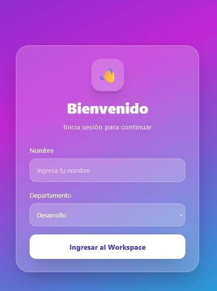
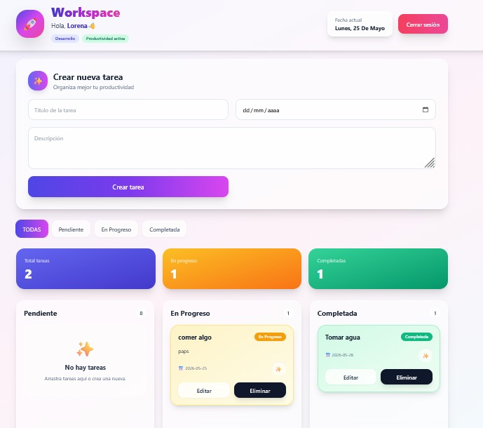
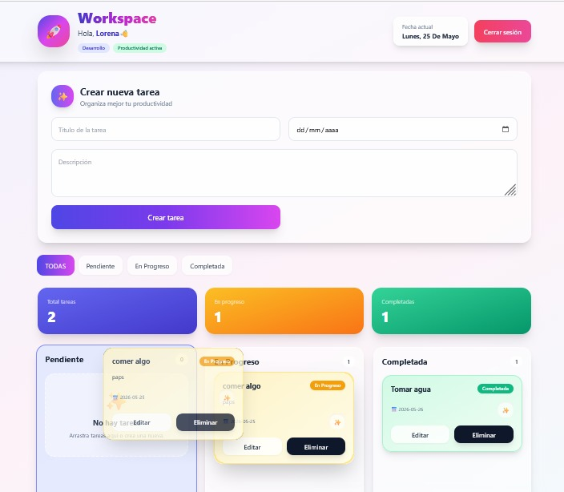
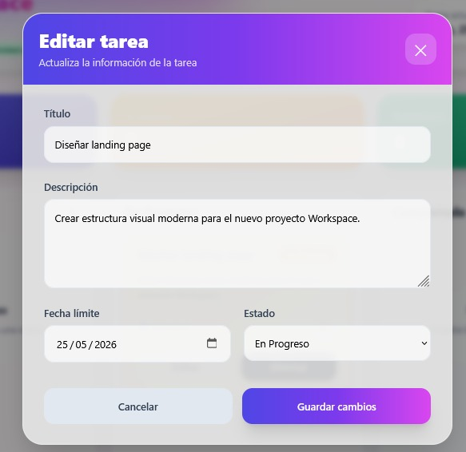
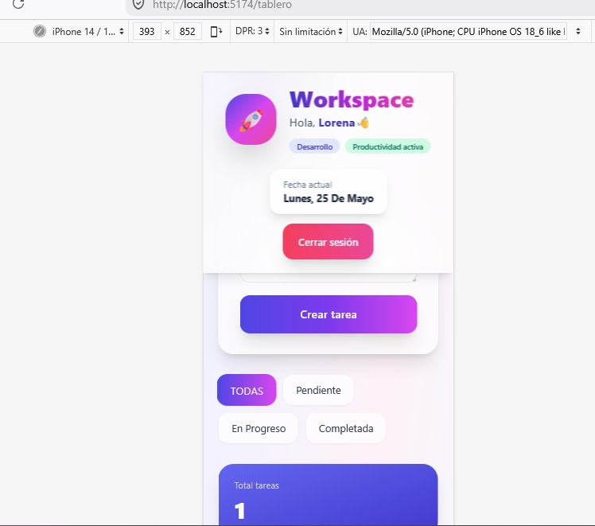

# 🚀 Workspace - Gestor de Tareas y Productividad

Aplicación web SPA desarrollada con React + Vite para la gestión de tareas de equipos de trabajo.

Este proyecto fue construido como prueba técnica enfocada en:
- Arquitectura frontend moderna
- CRUD completo
- UX/UI profesional
- Manejo de estado
- Persistencia de sesión
- Drag & Drop estilo Trello
- Buenas prácticas con GitFlow

---

# ✨ Características

✅ Inicio de sesión con LocalStorage  
✅ Protección de rutas privadas  
✅ CRUD completo de tareas  
✅ Consumo de API REST  
✅ Drag & Drop entre columnas  
✅ Modal premium de edición  
✅ Confirmaciones con SweetAlert2  
✅ Loader mientras carga la API  
✅ Filtros por estado  
✅ Responsive Design  
✅ Glassmorphism UI  
✅ Dashboard moderno tipo SaaS  

---

# 🛠️ Stack Tecnológico

- React.js
- Vite
- React Router DOM
- Tailwind CSS
- SweetAlert2
- Axios
- MockAPI
- LocalStorage
- Git & GitHub
- Vercel

---

# 🌐 API Mockeada

API utilizada:

https://6a14c5b191ff9a63de070727.mockapi.io/api/tasks

---

# 📸 Screenshots

## 🔐 Login



---

## 📋 Dashboard



---

## 🚀 Drag & Drop



---

## ✏️ Modal de edición



---

## 📱 Responsive



---

# ⚙️ Instalación Local

## 1. Clonar repositorio

```bash
git clone TU_REPOSITORIO
```

---

## 2. Entrar al proyecto

```bash
cd pruebatecnica-lorena
```

---

## 3. Instalar dependencias

```bash
npm install
```

---

## 4. Ejecutar servidor

```bash
npm run dev
```

---

# 📂 Arquitectura del Proyecto

```txt
src/
│
├── components/
│   ├── EditTaskModal.jsx
│   ├── Loader.jsx

│
├── context/
│   └── AuthContext.jsx
│
├── pages/
│   ├── Login.jsx
│   └── Dashboard.jsx
│
├── routes/
│   └── PrivateRoute.jsx
│
├── services/
│   └── taskService.js
│
├── App.jsx
├── main.jsx
```

---

# 🌳 GitFlow Implementado

El proyecto fue desarrollado usando flujo GitFlow:

- main
- develop
- feature/*
- fix/*

Con commits descriptivos siguiendo convenciones profesionales.

---

# 🚀 Deploy

Aplicación desplegada en Vercel:

TU_LINK_VERCEL_AQUI

---

# 👩‍💻 Autor

Desarrollado por Lorena Ruiz Pérez